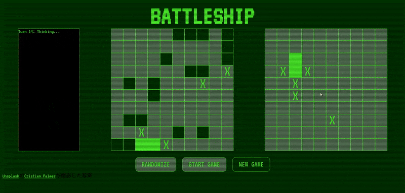

# 🚢 Battleship Game

A browser-based Battleship game built with JavaScript that allows users to play against a CPU opponent with intelligent targeting logic.

🔗 [Live Demo on Github Pages]([https://katekat25.github.io/battleship/])

---

## ⚙️ Technologies Used

- JavaScript (ES6+)  
- HTML & CSS    
- Jest (for testing)

---

## ✨ Features

- Interactive Battleship gameplay against a CPU opponent  
- Advanced CPU AI with multiple targeting modes for smarter attacks  
- Real-time game updates and hit/miss tracking  
- Modular game logic and clean code organization  
- Unit tests for core game functionality

---

## 📚 What I Learned

- Developed custom AI logic with strategic targeting algorithms  
- Practiced organizing JavaScript code for a larger project  
- Used event handling and DOM manipulation effectively  
- Wrote tests to ensure correctness of game mechanics  
- Gained experience deploying interactive apps with Vite and Netlify

---

## 🚧 Future Improvements

- Make the game fully responsive for mobile and tablet devices  
- Add multiple difficulty levels for the CPU  
- Track score history and player statistics
- Add a play log that records all past moves
# battleship
